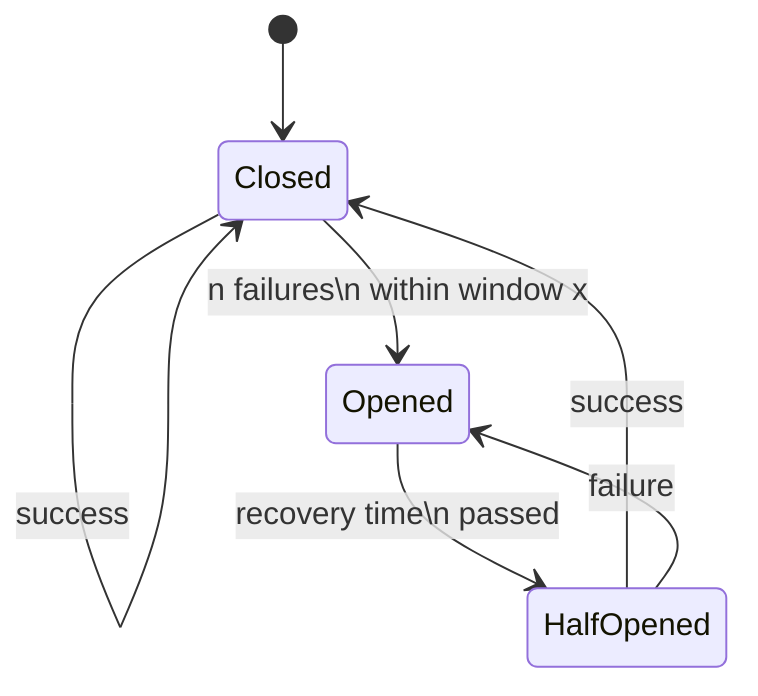

[](https://swift.org)

[](https://img.shields.io/badge/Platforms-macOS_iOS_tvOS_watchOS_vision_OS_Linux_Windows_Android-Green?style=flat-square)
[](https://img.shields.io/badge/Swift_Package_Manager-compatible-orange?style=flat-square)

[](https://firstdonoharm.dev/version/3/0/media-mil-my-tal-xuar.html)


# Circuit Breaker #
The circuit breaker pattern is meant to enhance application resilience by preventing repeated attempts to perform operations that are likely to fail. Similar to an electrical circuit breaker, it monitors recent failures in a service or operation. If failures exceed a threshold within a defined window, the circuit breaker temporarily stops further attempts, allowing the service time to recover. This prevents cascading failures and conserves resources, improving application stability.

[Wikipedia: Circuit breaker design pattern](https://en.wikipedia.org/wiki/Circuit_breaker_design_pattern)

## Why
- Stops sending requests to failing services, giving them time to recover and preventing overload.
- Isolates issues in one service from affecting others, maintaining overall system stability.
- Prevents unnecessary retries, saving bandwidth and reducing server load.

Overall, the circuit breaker pattern ensures more resilient and responsive interactions between clients and backend systems, leading to better performance and reliability.

## State Diagram



## Installation

### Swift Package Manager

Once you have your Swift package set up, adding a dependency is as easy as adding it to the `dependencies` value of your `Package.swift` or the Package list in Xcode.

```swift
dependencies: [
    .package(url: "https://github.com/AlexanderNey/CircuitBreaker", .upToNextMajor(from: "1.0.0"))
]
```

Normally you'll want to depend on the `CircuitBreaker` target:

```swift
.product(name: "CircuitBreaker", package: "CircuitBreaker")
```

See [Adding Package Dependencies to Your App](https://developer.apple.com/documentation/xcode/adding_package_dependencies_to_your_app) on how to use this library with Swift PM.

Additional info to the [Swift Package Manager](https://swift.org/package-manager/).


## Usage
The following code demonstrates how to use a CircuitBreaker to execute asynchronous tasks, such as network requests:
```swift
let breaker = await CircuitBreaker(config: config)
let processedData = try await breaker.run {
    let (data, response) = try await URLSession.shared.data(from: url)
    // Handle the data and response
    return processedData
}
```
If the task fails and the circuit was closed, the CircuitBreaker will rethrow the original error from the task.
If the circuit is open or half-open and the task fails, the CircuitBreaker will throw a `CircuitOpenError`. In all other cases the result of the task is returned.

#### Note:
If a `CircuitOpenError` is thrown, the operation should not be immediately repeated. The circuit breaker is open and will take time to recover. Any repeated tasks will have no effect during this recovery period. 

## Config
To configure the CircuitBreaker, you need to set its parameters based on your application's specific requirements:

- **name:** Identifier for the service or task category (used for logging and monitoring).
- **group:** Optional group name for debugging and categorization.
- **recoveryTimeout:** Time to wait before moving from open to half-open state.
- **maxFailures:** Maximum allowed failures within the rolling window to trip the breaker.
- **rollingWindow:** Time period for counting failures to trigger the open state.

```swift
// Example configuration
let config = CircuitBreaker.Config(
    name: "UserServiceAPI",
    group: "NetworkServices",
    recoveryTimeout: 30, // 30 seconds
    maxFailures: 5, // Maximum 5 failures
    rollingWindow: 60 // Within a 60-second window
)
```

### License
[HL3-MEDIA-MIL-MY-TAL-XUAR](https://firstdonoharm.dev/version/3/0/media-mil-my-tal-xuar.html) License TLDR:

Don't worry*, you are free to modify, distribute and use this software for private or commercial use without mentioning the author. However there are a few restrictions that promotes ethical software development by requiring adherence to guidelines that prevent harm and respect human rights and ensures the software is freely usable and modifiable.

